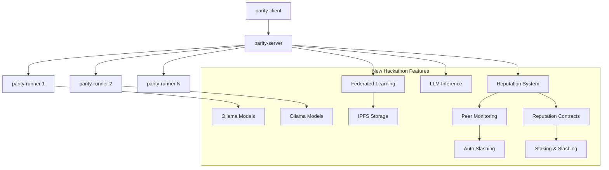

# Parity Protocol

[](https://go.dev/)
[](https://www.postgresql.org/)
[](https://www.docker.com/)
[](https://filecoin.io/)
[](LICENSE)

## 🚀 Introduction

**Parity Protocol** is a cutting-edge distributed computation network that enables secure and verifiable task execution across verified nodes. Originally built as a foundational distributed compute platform, **we have significantly enhanced it during the hackathon** with advanced federated learning capabilities, LLM inference services, reputation-based monitoring, and IPFS/Filecoin distributed storage.

> **⚡ IMPORTANT**: This repository contains high-level documentation and system overview. **For actual implementation, source code, and detailed setup instructions, visit the individual component repositories:**
>
> - 🖥️ **[parity-server](https://github.com/virajbhartiya/parity-server)** - Task orchestration, federated learning coordination, and APIs
> - 🏃 **[parity-runner](https://github.com/virajbhartiya/parity-runner)** - Secure task execution, Docker sandboxing, and Ollama LLM hosting
> - 🔌 **[parity-client](https://github.com/virajbhartiya/parity-client)** - CLI tools, federated learning commands, and task submission
> - 📜 **[parity-reputation-contracts](https://github.com/virajbhartiya/parity-reputation-contracts)** - Smart contracts for reputation and staking

## 🎯 What Was Already There (Pre-Hackathon)

The **foundational Parity Protocol infrastructure** was already established and included:

- ✅ **Distributed Task Execution**: Secure Docker-based task processing
- ✅ **Node Management**: Runner registration and task distribution
- ✅ **Blockchain Integration**: ERC-20 token economics and staking
- ✅ **Wallet Infrastructure**: Secure token management and transfers
- ✅ **Core APIs**: RESTful interfaces for task submission and monitoring

## 🆕 What We Added During Hackathon

We transformed Parity Protocol into a comprehensive **AI and ML platform** by adding:

### 🤖 **Federated Learning System**

- **Privacy-Preserving ML**: Train models without centralizing data
- **Multiple Aggregation Methods**: FedAvg, FedProx, and custom algorithms
- **Data Partitioning**: Non-IID, label skew, and stratified distribution
- **Differential Privacy**: Advanced privacy protection mechanisms
- **Real-time Coordination**: Distributed training across multiple runners

📖 [**Federated Learning Guide**](documentation/FEDERATED_LEARNING_GUIDE.md)

### 🧠 **LLM Inference Network**

- **Distributed AI**: Ollama-powered LLM hosting across runners
- **Model Discovery**: Automatic detection of available models
- **Load Balancing**: Intelligent request distribution
- **Usage Analytics**: Comprehensive billing and metrics
- **Multi-Model Support**: Llama, Mistral, CodeLlama, and more

📖 [**LLM Models Guide**](documentation/LLM_MODELS_GUIDE.md)

### 🛡️ **Reputation & Monitoring System**

- **Peer-to-Peer Monitoring**: Runners monitor each other for quality
- **Automatic Slashing**: Bad actors lose staked tokens
- **Quality Metrics**: Performance and reliability scoring
- **Malicious Behavior Detection**: Advanced anomaly detection

📖 [**FL Infrastructure Quality**](documentation/FL_INFRASTRUCTURE_QUALITY.md)

### 📁 **IPFS/Filecoin Storage**

- **Distributed Data**: Decentralized storage for training datasets
- **Content Addressing**: Immutable data references via CIDs
- **Upload/Download**: Seamless integration with FL workflows
- **Storage Economics**: Filecoin-based data persistence

📖 [**Data Partitioning Guide**](documentation/DATA_PARTITIONING_GUIDE.md)

### 💰 **Enhanced Economics**

- **USDFC Rewards**: Real blockchain payments for ML contributions
- **FL-Specific Incentives**: Rewards based on data quality and participation
- **Performance Bonuses**: Higher rewards for better contributions
- **Session Completion Bonuses**: Long-term participation incentives

📖 [**FL Rewards System**](documentation/FL_REWARDS_SYSTEM.md)

### 📜 **Smart Contracts**

- **Reputation Management**: On-chain reputation scoring and tracking
- **Automated Slashing**: Smart contract-based penalty enforcement
- **Staking Requirements**: Minimum stake requirements for participation
- **Peer Monitoring Rewards**: Economic incentives for quality monitoring
- **Transparent Governance**: Decentralized quality control mechanisms

📖 [**Reputation Contracts Repository**](https://github.com/virajbhartiya/parity-reputation-contracts)

## 🏗️ System Architecture

### Core Components (Pre-Existing)

| Component                          | Repository                                                                                                | Purpose                           |
| ---------------------------------- | --------------------------------------------------------------------------------------------------------- | --------------------------------- |
| 🖥️ **parity-server**               | [virajbhartiya/parity-server](https://github.com/virajbhartiya/parity-server)                             | Task orchestration and validation |
| 🏃 **parity-runner**               | [virajbhartiya/parity-runner](https://github.com/virajbhartiya/parity-runner)                             | Secure task execution in Docker   |
| 🔌 **parity-client**               | [virajbhartiya/parity-client](https://github.com/virajbhartiya/parity-client)                             | Task submission and monitoring    |
| 💎 **parity-token**                | [theblitlabs/parity-token](https://github.com/theblitlabs/parity-token)                                   | ERC20 token and economics         |
| 👛 **parity-wallet**               | [virajbhartiya/parity-wallet](https://github.com/virajbhartiya/parity-wallet)                             | Secure token management           |
| 📜 **parity-reputation-contracts** | [virajbhartiya/parity-reputation-contracts](https://github.com/virajbhartiya/parity-reputation-contracts) | Smart contracts for reputation    |

> **📂 View Implementation Details**: This repository contains the high-level documentation and overview. **To see the actual implementation, code, and detailed setup instructions, please visit the individual component repositories linked above.** Each repository contains:
>
> - Complete source code and implementation
> - Detailed README with setup instructions
> - API documentation and examples
> - Component-specific configuration guides

### New Features Added



## 🚀 Quick Start

### Prerequisites

- **Go 1.22.7+**
- **PostgreSQL 14.0+**
- **Docker** with Docker Compose
- **Ollama** (for LLM inference)
- **USDFC tokens** on Filecoin Calibration Network

### 1. Clone and Setup

```bash
# Clone the main repository
git clone https://github.com/your-org/parity-protocol.git
cd parity-protocol

# Setup individual components (see parity-protocol/README.md for details)
```

> **🔗 Important**: This repository provides documentation and overview only. **For complete setup instructions, implementation details, and running the services, you must visit each individual component repository:**
>
> - **Server Implementation**: [virajbhartiya/parity-server](https://github.com/virajbhartiya/parity-server) - Complete server setup and APIs
> - **Runner Implementation**: [virajbhartiya/parity-runner](https://github.com/virajbhartiya/parity-runner) - Docker execution and Ollama integration
> - **Client Implementation**: [virajbhartiya/parity-client](https://github.com/virajbhartiya/parity-client) - CLI tools and federated learning commands

### 2. Start Core Services

```bash
# Start server (with new FL and LLM capabilities)
cd parity-server
./parity-server server

# Start runner (with FL training and LLM hosting)
cd parity-runner
./parity-runner runner

# Start Ollama for LLM inference
ollama serve
```

### 3. Try New Features

```bash
# Submit LLM inference request
./parity-client llm submit --prompt "Explain quantum computing" --model "llama2"

# Create federated learning session
./parity-client fl create-session-with-data ./dataset.csv \
  --name "Image Classification" \
  --model-type neural_network \
  --total-rounds 5

# Check reputation status
./parity-client reputation status
```

## 📚 Documentation

### User Guides

- 🤖 [**Federated Learning Guide**](documentation/FEDERATED_LEARNING_GUIDE.md) - Complete FL user manual
- 🧠 [**LLM Models Guide**](documentation/LLM_MODELS_GUIDE.md) - LLM inference and hosting
- 📊 [**Data Partitioning Guide**](documentation/DATA_PARTITIONING_GUIDE.md) - Data distribution strategies

### Operations & Infrastructure

- 🚀 [**Deployment Guide**](documentation/DEPLOYMENT_GUIDE.md) - Complete system deployment
- 💰 [**FL Rewards System**](documentation/FL_REWARDS_SYSTEM.md) - Economic incentives
- 🏗️ [**FL Infrastructure Quality**](documentation/FL_INFRASTRUCTURE_QUALITY.md) - Quality framework

### Component Documentation

- 📖 [**Parity Protocol Core**](parity-protocol/README.md) - Original system documentation
- 🔗 Individual component READMEs in respective repositories

## 🎮 Use Cases

### Federated Learning

- **Healthcare**: Train medical models without sharing patient data
- **Finance**: Collaborative fraud detection across institutions
- **IoT**: Edge device learning with privacy preservation
- **Research**: Multi-institutional AI research collaboration

### LLM Inference

- **Distributed AI**: Decentralized language model hosting
- **Cost Optimization**: Efficient resource utilization across network
- **Model Diversity**: Access to multiple specialized models
- **Censorship Resistance**: Distributed inference prevents single points of failure

### Reputation & Quality

- **Network Security**: Automated detection and punishment of bad actors
- **Quality Assurance**: Continuous monitoring of participant performance
- **Trust Building**: Transparent reputation system for all participants

## 🤝 Contributing

We welcome contributions to both the **original Parity Protocol infrastructure** and the **new hackathon features**!

### Areas for Contribution

**Core Platform** (Original):

- Task execution optimizations
- Wallet and token improvements
- Infrastructure scaling

**New Features** (Hackathon Additions):

- New FL aggregation algorithms
- Additional LLM model support
- Enhanced reputation mechanisms
- Storage optimizations

### Get Started

1. **Choose a Component**: Pick from server, runner, client, or documentation
2. **Check Issues**: Look for open issues in the relevant repository
3. **Follow Guidelines**: Use [Conventional Commits](https://www.conventionalcommits.org/)
4. **Test Thoroughly**: Ensure both original and new features work

## 📊 Network Stats

- **Blockchain**: Filecoin Calibration Network
- **Token**: USDFC (ERC-20)
- **Storage**: IPFS/Filecoin distributed storage
- **Privacy**: Differential privacy for FL
- **Models**: 20+ supported LLM models via Ollama

## 🏆 Hackathon Achievements

During the hackathon, we successfully transformed Parity Protocol from a general distributed compute platform into a **comprehensive AI infrastructure** with:

- **Full Federated Learning Pipeline** - From data upload to model training
- **Production LLM Network** - Real distributed inference capabilities
- **Automated Quality Control** - Peer monitoring and reputation management
- **Decentralized Storage** - IPFS/Filecoin integration for data persistence
- **Real Economic Incentives** - USDFC token rewards for AI contributions

**The result**: A production-ready platform for privacy-preserving AI that combines the best of decentralized compute, federated learning, and token economics.

---

🚀 **Ready to build the future of distributed AI?** Start with our [Deployment Guide](documentation/DEPLOYMENT_GUIDE.md)!
