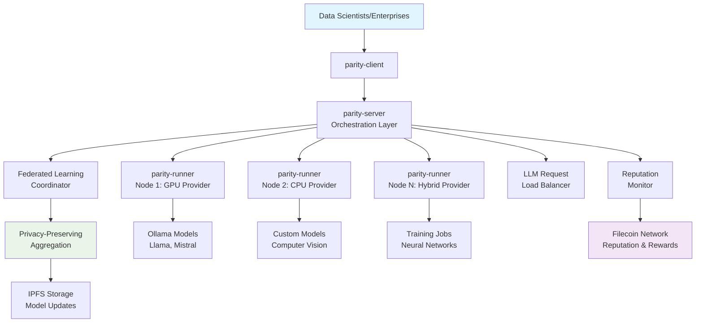
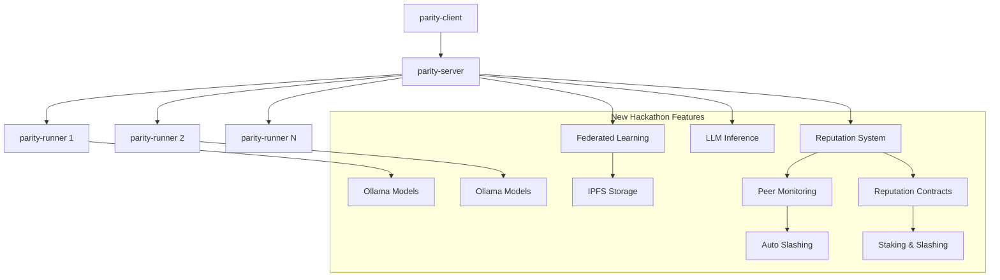

# Parity Protocol

[](https://go.dev/)
[](https://www.postgresql.org/)
[](https://www.docker.com/)
[](https://filecoin.io/)
[](LICENSE)

> **IMPLEMENTATION REPOSITORIES**: This repository contains high-level documentation and system overview. **For actual implementation, source code, and detailed setup instructions, visit the individual component repositories:**
>
> - **[parity-server](https://github.com/virajbhartiya/parity-server)** - Task orchestration, federated learning coordination, and APIs
> - **[parity-runner](https://github.com/virajbhartiya/parity-runner)** - Secure task execution, Docker sandboxing, and Ollama LLM hosting
> - **[parity-client](https://github.com/virajbhartiya/parity-client)** - CLI tools, federated learning commands, and task submission
> - **[parity-reputation-contracts](https://github.com/virajbhartiya/parity-reputation-contracts)** - Smart contracts for reputation and staking

## Sponsor Integration

### Filecoin & USDFC Integration

**Parity Protocol leverages Filecoin's decentralized storage and USDFC token economics to create a comprehensive AI infrastructure platform:**

#### Filecoin Integration
- **Distributed Storage**: All federated learning datasets and model updates are stored on IPFS/Filecoin network
- **Content Addressing**: Immutable data references via CIDs ensure data integrity and provenance
- **Decentralized Persistence**: No single point of failure for critical AI training data
- **Storage Economics**: Filecoin's economic model incentivizes reliable data storage across the network
- **Privacy-Preserving**: Data remains distributed while enabling collaborative AI training

#### USDFC Token Economics
- **Compute Rewards**: Node operators earn USDFC tokens for successful AI task execution
- **Staking Requirements**: Minimum USDFC stake required for network participation and quality assurance
- **Automated Payments**: Smart contracts handle instant USDFC transfers for completed federated learning rounds
- **Reputation Bonding**: USDFC stakes act as reputation bonds, with slashing for poor performance
- **Economic Incentives**: Performance bonuses and session completion rewards in USDFC
- **Decentralized Governance**: USDFC holders participate in network quality decisions

#### AI Infrastructure Innovation
- **Federated Learning**: Privacy-preserving AI training without data centralization
- **Distributed LLM Inference**: Decentralized hosting of large language models
- **Quality Assurance**: Peer monitoring and reputation systems ensure AI model quality
- **Cost Optimization**: 60-80% cost reduction compared to traditional cloud AI services
- **Censorship Resistance**: No single entity controls AI compute or model access

### Hackathon Achievement: Complete Sponsor Integration

**During this hackathon, we successfully integrated both Filecoin and USDFC into every aspect of the AI infrastructure:**

1. **Filecoin Storage Layer**: All AI datasets, model checkpoints, and training artifacts stored on IPFS/Filecoin
2. **USDFC Token Flow**: Complete economic system from task submission to reward distribution
3. **Smart Contract Integration**: Reputation contracts on Filecoin Calibration Network
4. **Decentralized AI Pipeline**: End-to-end AI workflow leveraging Filecoin's distributed infrastructure
5. **Economic Incentives**: USDFC rewards for quality AI contributions and network participation

**This integration demonstrates how Filecoin's storage capabilities and USDFC's economic model can power the next generation of decentralized AI infrastructure.**

## What is Parity Protocol?

**Parity Protocol** is a **decentralized AI infrastructure platform** that enables organizations and individuals to run AI workloads (federated learning, LLM inference, computer vision) across a distributed network of verified compute nodes - **without sacrificing data privacy or paying centralized cloud providers**.

### The Problem We Solve

**Traditional AI infrastructure has critical limitations:**

- **Centralized Control**: Big Tech controls AI compute (AWS, Google Cloud, Azure)
- **High Costs**: Enterprise AI workloads cost thousands per month
- **Data Privacy**: Sensitive data must leave your organization
- **Censorship Risk**: Centralized providers can restrict or ban AI usage
- **Limited Access**: GPU shortages and waitlists for advanced models

### Our Solution: Decentralized AI Infrastructure

**Parity Protocol creates a global network where:**

- **Anyone can contribute compute** - Monetize your unused GPUs and CPUs
- **Privacy-first AI training** - Train models without sharing raw data (federated learning)
- **Lower costs** - Competitive pricing through decentralized competition
- **Censorship resistance** - No single point of control or failure
- **Multiple AI services** - LLM inference, federated learning, computer vision
- **Quality guaranteed** - Blockchain-based reputation and staking system

## Real-World Use Cases

### Healthcare: Privacy-Preserving Medical AI

- Train diagnostic models across hospitals without sharing patient data
- Comply with HIPAA while improving AI accuracy through collaboration
- **Example**: Multi-hospital cancer detection model without data leaving premises

### Finance: Collaborative Fraud Detection

- Banks train fraud models together without sharing transaction data
- Improve detection rates while maintaining competitive privacy
- **Example**: Global fraud patterns detected across institutions

### Distributed LLM Hosting

- Host and monetize large language models on your hardware
- Access diverse models without vendor lock-in
- **Example**: Run Llama, Mistral, CodeLlama across the network

### Enterprise AI

- Reduce AI compute costs by 60-80% vs traditional cloud
- Maintain data sovereignty and compliance
- **Example**: Manufacturing quality control models trained federally

## How It Works



### The Process

1. **Submit Task**: Data scientists submit AI tasks via `parity-client`
2. **Orchestration**: `parity-server` finds optimal compute nodes
3. **Execution**: `parity-runner` nodes execute tasks in secure Docker containers
4. **Privacy**: Federated learning keeps data local, only shares model updates
5. **Rewards**: Blockchain automatically pays compute providers in USDFC tokens
6. **Quality**: Peer monitoring ensures reliability and punishes bad actors

## Evolution: From Distributed Compute to AI Infrastructure

Originally built as a foundational distributed compute platform, **we have significantly enhanced Parity Protocol during the hackathon** to become a comprehensive AI infrastructure platform, adding advanced federated learning capabilities, LLM inference services, reputation-based monitoring, and IPFS/Filecoin distributed storage.

## Foundation (Pre-Hackathon)

The **foundational Parity Protocol infrastructure** was already established and included:

- ✅ **Distributed Task Execution**: Secure Docker-based task processing
- ✅ **Node Management**: Runner registration and task distribution
- ✅ **Blockchain Integration**: ERC-20 token economics and staking
- ✅ **Wallet Infrastructure**: Secure token management and transfers
- ✅ **Core APIs**: RESTful interfaces for task submission and monitoring

## What We Added During Hackathon

We transformed Parity Protocol into a comprehensive **AI and ML platform** by adding:

### Federated Learning System

- **Privacy-Preserving ML**: Train models without centralizing data
- **Multiple ML Algorithms**: Neural networks, linear regression, and distributed random forest
- **Distributed Random Forest**: Complete random forest implementation with federated learning support
  - Bootstrap sampling with configurable subsample ratios
  - Random feature selection for variance reduction
  - Out-of-bag scoring for model validation
  - Privacy-preserving model aggregation across nodes
  - Feature importance calculation and tracking
- **Multiple Aggregation Methods**: FedAvg, FedProx, and custom algorithms
- **Data Partitioning**: Non-IID, label skew, and stratified distribution
- **IPFS Integration**: Mandatory IPFS storage for all datasets with CID-based access
- **Differential Privacy**: Advanced privacy protection mechanisms
- **Real-time Coordination**: Distributed training across multiple runners

[**Federated Learning Guide**](documentation/FEDERATED_LEARNING_GUIDE.md)

### LLM Inference Network

- **Distributed AI**: Ollama-powered LLM hosting across runners
- **Model Discovery**: Automatic detection of available models
- **Load Balancing**: Intelligent request distribution
- **Usage Analytics**: Comprehensive billing and metrics
- **Multi-Model Support**: Llama, Mistral, CodeLlama, and more

[**LLM Models Guide**](documentation/LLM_MODELS_GUIDE.md)

### Reputation & Monitoring System

- **Peer-to-Peer Monitoring**: Runners monitor each other for quality
- **Automatic Slashing**: Bad actors lose staked tokens
- **Quality Metrics**: Performance and reliability scoring
- **Malicious Behavior Detection**: Advanced anomaly detection

[**FL Infrastructure Quality**](documentation/FL_INFRASTRUCTURE_QUALITY.md)

### IPFS/Filecoin Storage

- **Distributed Data**: Decentralized storage for training datasets
- **Content Addressing**: Immutable data references via CIDs
- **Upload/Download**: Seamless integration with FL workflows
- **Storage Economics**: Filecoin-based data persistence

[**Data Partitioning Guide**](documentation/DATA_PARTITIONING_GUIDE.md)

### Enhanced Economics

- **USDFC Rewards**: Real blockchain payments for ML contributions
- **FL-Specific Incentives**: Rewards based on data quality and participation
- **Performance Bonuses**: Higher rewards for better contributions
- **Session Completion Bonuses**: Long-term participation incentives

[**FL Rewards System**](documentation/FL_REWARDS_SYSTEM.md)

### Smart Contracts

- **Reputation Management**: On-chain reputation scoring and tracking
- **Automated Slashing**: Smart contract-based penalty enforcement
- **Staking Requirements**: Minimum stake requirements for participation
- **Peer Monitoring Rewards**: Economic incentives for quality monitoring
- **Transparent Governance**: Decentralized quality control mechanisms

[**Reputation Contracts Repository**](https://github.com/virajbhartiya/parity-reputation-contracts)

## System Architecture

### Core Components (Pre-Existing)

| Component                       | Repository                                                                                                | Purpose                           |
| ------------------------------- | --------------------------------------------------------------------------------------------------------- | --------------------------------- |
| **parity-server**               | [virajbhartiya/parity-server](https://github.com/virajbhartiya/parity-server)                             | Task orchestration and validation |
| **parity-runner**               | [virajbhartiya/parity-runner](https://github.com/virajbhartiya/parity-runner)                             | Secure task execution in Docker   |
| **parity-client**               | [virajbhartiya/parity-client](https://github.com/virajbhartiya/parity-client)                             | Task submission and monitoring    |
| **parity-token**                | [theblitlabs/parity-token](https://github.com/theblitlabs/parity-token)                                   | ERC20 token and economics         |
| **parity-wallet**               | [virajbhartiya/parity-wallet](https://github.com/virajbhartiya/parity-wallet)                             | Secure token management           |
| **parity-reputation-contracts** | [virajbhartiya/parity-reputation-contracts](https://github.com/virajbhartiya/parity-reputation-contracts) | Smart contracts for reputation    |

> **View Implementation Details**: This repository contains the high-level documentation and overview. **To see the actual implementation, code, and detailed setup instructions, please visit the individual component repositories linked above.** Each repository contains:
>
> - Complete source code and implementation
> - Detailed README with setup instructions
> - API documentation and examples
> - Component-specific configuration guides

### New Features Added



## Get Started

### For End Users (Data Scientists, Enterprises)

**Want to run AI workloads on the network?**

1. **Get tokens**: Acquire USDFC tokens on Filecoin Calibration Network
2. **Install client**: Download [parity-client](https://github.com/virajbhartiya/parity-client)
3. **Submit tasks**: Use CLI to submit LLM inference or federated learning jobs
4. **Monitor progress**: Track task execution and costs in real-time

### For Node Operators (Compute Providers)

**Want to monetize your compute resources?**

1. **Set up runner**: Install [parity-runner](https://github.com/virajbhartiya/parity-runner)
2. **Stake tokens**: Stake USDFC tokens to participate in the network
3. **Install Ollama**: Set up LLM models for inference requests
4. **Earn rewards**: Get paid automatically for successful task completion

### For Developers (Integration & Extensions)

**Want to integrate or extend the platform?**

1. **Study architecture**: Review component documentation and APIs
2. **Set up development**: Clone [parity-server](https://github.com/virajbhartiya/parity-server) for core orchestration
3. **Build features**: Extend federated learning algorithms or add new model types
4. **Test integration**: Use local development setup for testing

> **COMPLETE SETUP INSTRUCTIONS**: This repository provides the high-level overview. **For detailed setup, installation guides, and running instructions, visit each component repository:**
>
> - **[parity-server](https://github.com/virajbhartiya/parity-server)** - Core orchestration, APIs, setup instructions
> - **[parity-runner](https://github.com/virajbhartiya/parity-runner)** - Node setup, Docker configuration, Ollama integration
> - **[parity-client](https://github.com/virajbhartiya/parity-client)** - CLI installation, usage examples, commands
> - **[parity-reputation-contracts](https://github.com/virajbhartiya/parity-reputation-contracts)** - Smart contract deployment

### Quick Demo Commands

Once you have the components set up, try these examples:

```bash
# Submit LLM inference request
./parity-client llm submit \
  --prompt "Explain quantum computing in simple terms" \
  --model "llama2"

# Create federated learning session with neural network
./parity-client fl create-session-with-data ./healthcare_data.csv \
  --name "Privacy-Preserving Diagnosis" \
  --model-type neural_network \
  --total-rounds 10 \
  --privacy-level high

# Create federated learning session with random forest
./parity-client fl create-session-with-data ./iris_data.csv \
  --name "Distributed Classification" \
  --model-type random_forest \
  --total-rounds 5 \
  --privacy-level high

# Check your node reputation and earnings
./parity-client reputation status
./parity-client wallet balance
```

## Documentation

### User Guides

- [**Federated Learning Guide**](documentation/FEDERATED_LEARNING_GUIDE.md) - Complete FL user manual
- [**LLM Models Guide**](documentation/LLM_MODELS_GUIDE.md) - LLM inference and hosting
- [**Data Partitioning Guide**](documentation/DATA_PARTITIONING_GUIDE.md) - Data distribution strategies

### Operations & Infrastructure

- [**Deployment Guide**](documentation/DEPLOYMENT_GUIDE.md) - Complete system deployment
- [**FL Rewards System**](documentation/FL_REWARDS_SYSTEM.md) - Economic incentives
- [**FL Infrastructure Quality**](documentation/FL_INFRASTRUCTURE_QUALITY.md) - Quality framework

### Component Documentation

- [**Parity Protocol Core**](parity-protocol/README.md) - Original system documentation
- Individual component READMEs in respective repositories

## Use Cases

### Federated Learning

- **Healthcare**: Train medical models without sharing patient data
- **Finance**: Collaborative fraud detection across institutions
- **IoT**: Edge device learning with privacy preservation
- **Research**: Multi-institutional AI research collaboration

### LLM Inference

- **Distributed AI**: Decentralized language model hosting
- **Cost Optimization**: Efficient resource utilization across network
- **Model Diversity**: Access to multiple specialized models
- **Censorship Resistance**: Distributed inference prevents single points of failure

### Reputation & Quality

- **Network Security**: Automated detection and punishment of bad actors
- **Quality Assurance**: Continuous monitoring of participant performance
- **Trust Building**: Transparent reputation system for all participants

## Contributing

We welcome contributions to both the **original Parity Protocol infrastructure** and the **new hackathon features**!

### Areas for Contribution

**Core Platform** (Original):

- Task execution optimizations
- Wallet and token improvements
- Infrastructure scaling

**New Features** (Hackathon Additions):

- New FL aggregation algorithms
- Additional LLM model support
- Enhanced reputation mechanisms
- Storage optimizations

### Get Started

1. **Choose a Component**: Pick from server, runner, client, or documentation
2. **Check Issues**: Look for open issues in the relevant repository
3. **Follow Guidelines**: Use [Conventional Commits](https://www.conventionalcommits.org/)
4. **Test Thoroughly**: Ensure both original and new features work

## Network Stats

- **Blockchain**: Filecoin Calibration Network
- **Token**: USDFC (ERC-20)
- **Storage**: IPFS/Filecoin distributed storage
- **Privacy**: Differential privacy for FL
- **Models**: 20+ supported LLM models via Ollama

## Hackathon Achievements

During the hackathon, we successfully transformed Parity Protocol from a general distributed compute platform into a **comprehensive AI infrastructure** with:

- **Full Federated Learning Pipeline** - From data upload to model training
- **Production LLM Network** - Real distributed inference capabilities
- **Automated Quality Control** - Peer monitoring and reputation management
- **Decentralized Storage** - IPFS/Filecoin integration for data persistence
- **Real Economic Incentives** - USDFC token rewards for AI contributions

**The result**: A production-ready platform for privacy-preserving AI that combines the best of decentralized compute, federated learning, and token economics.

## Vision: Democratizing AI Infrastructure

### The Future We're Building

**Parity Protocol isn't just a hackathon project** - it's a foundational piece of the decentralized AI future:

- **AI Independence**: Breaking Big Tech's monopoly on AI compute and data
- **Privacy-First AI**: Training powerful models without compromising data privacy
- **Fair Economics**: Compute providers earn fair rewards, users pay fair prices
- **Global Access**: Anyone, anywhere can participate in and benefit from AI progress
- **Censorship Resistance**: No central authority can restrict AI access or development

### Impact Potential

With Parity Protocol, we envision a world where:

- **Hospitals collaborate** on life-saving AI models without sharing patient data
- **Financial institutions** jointly fight fraud while maintaining competitive advantage
- **Developing nations** access cutting-edge AI without expensive infrastructure
- **Researchers everywhere** contribute to and benefit from AI breakthroughs
- **Innovation flourishes** without platform restrictions or vendor lock-in

### Join the Movement

Every line of code, every node operator, every researcher using privacy-preserving federated learning brings us closer to **truly decentralized AI infrastructure**.

**Whether you're:**

- A **developer** wanting to build the future of AI
- An **enterprise** seeking privacy-compliant AI solutions
- A **researcher** pushing the boundaries of federated learning
- An **entrepreneur** monetizing compute resources
- A **visionary** believing in decentralized technology

**You have a place in the Parity Protocol ecosystem.**

---

**Ready to build the future of distributed AI?** Start with our [Deployment Guide](documentation/DEPLOYMENT_GUIDE.md)!
