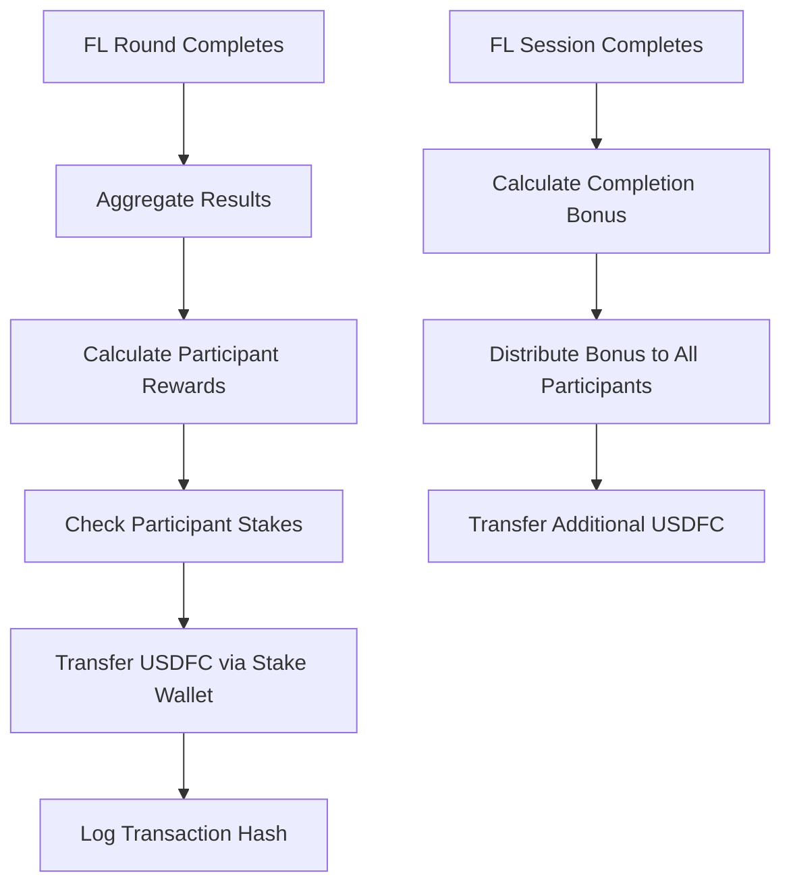

# Parity Protocol Federated Learning Rewards System

## Overview

The Parity Protocol FL system now includes automatic USDFC reward distribution using the same stake wallet infrastructure as Docker execution rewards. When participants complete FL training rounds, they receive rewards transferred directly to their stake wallets.

## How FL Rewards Work

### 🏆 Reward Types

1. **Round Completion Rewards**

   - Distributed after each FL round completion
   - Based on participant contribution and data quality
   - Calculated per round based on total session reward pool

2. **Session Completion Bonus**
   - Additional 10% bonus when entire FL session completes
   - Distributed equally among all session participants
   - Rewards long-term commitment to federated learning

### 💰 Reward Calculation

**Base Reward Pool Calculation:**

```
Base = 100 USDFC
Complexity Multiplier = 1.0-3.0 (based on model type)
Rounds Multiplier = rounds * 0.1
Participants Multiplier = participants * 0.5

Total Pool = Base × Complexity × (1 + Rounds) × (1 + Participants)
```

**Model Complexity Multipliers:**

- Linear Regression: 1.0x
- Neural Network: 2.0x
- Transformer: 3.0x
- Other models: 1.5x

**Per-Round Reward:**

```
Round Pool = Total Pool / Total Rounds
Participant Share = Round Pool / Completed Participants
Performance Bonus = up to 50% based on data contribution + 10% quality bonus
Final Reward = Participant Share × Performance Multiplier
```

### 🔄 Transfer Mechanism

FL rewards use the **same stake wallet system** as Docker execution rewards:

1. **Stake Wallet Required**: Participants must have stake registered
2. **USDFC Transfers**: Rewards transferred in USDFC tokens (18 decimals)
3. **Creator → Participant**: Transfers from session creator's stake to participant's stake
4. **Blockchain Confirmed**: All transfers are confirmed on-chain

### 📊 Reward Distribution Flow



### 🛠️ Technical Implementation

**Key Components:**

- `FLRewardService`: Handles reward calculation and distribution
- `StakeWallet`: Manages USDFC transfers between participants
- `TransferPayment()`: Core transfer method (same as Docker rewards)
- Automatic integration with FL round/session completion

**Code Integration:**

```go
// Round completion triggers reward distribution
func (s *FederatedLearningService) AggregateRound() error {
    // ... aggregation logic ...

    // Distribute rewards automatically
    if s.flRewardService != nil {
        go func() {
            s.flRewardService.DistributeRoundRewards(ctx, sessionID, roundID)
        }()
    }
}
```

### 💡 Example Reward Scenario

**Session Configuration:**

- Model Type: Neural Network (2.0x multiplier)
- Total Rounds: 5
- Participants: 3
- Base Reward: 100 USDFC

**Calculations:**

```
Total Pool = 100 × 2.0 × (1 + 0.5) × (1 + 1.5) = 750 USDFC
Per Round = 750 / 5 = 150 USDFC
Per Participant Base = 150 / 3 = 50 USDFC

With Performance Bonuses:
- High contributor (large dataset): 50 × 1.6 = 80 USDFC
- Medium contributor: 50 × 1.1 = 55 USDFC
- Base contributor: 50 × 1.0 = 50 USDFC

Session Completion Bonus = 75 USDFC / 3 = 25 USDFC each
```

**Total Rewards per Participant (5 rounds + bonus):**

- High contributor: (80 × 5) + 25 = **425 USDFC**
- Medium contributor: (55 × 5) + 25 = **300 USDFC**
- Base contributor: (50 × 5) + 25 = **275 USDFC**

### 🔧 Configuration

**Prerequisites:**

1. Participants must have stake wallet addresses registered
2. Session creator must have sufficient USDFC staked
3. Filecoin network configuration must be properly set

**Automatic Operation:**

- No manual intervention required
- Rewards distributed automatically on round/session completion
- Failed transfers are logged but don't block FL progress
- Supports both mock (testing) and production wallets

### 📈 Benefits

1. **Incentivized Participation**: Direct USDFC rewards encourage quality participation
2. **Fair Distribution**: Rewards based on actual contribution and data quality
3. **Transparent**: All transfers recorded on blockchain with transaction hashes
4. **Integrated**: Uses proven stake wallet infrastructure from Docker rewards
5. **Scalable**: Supports any number of participants and session complexity

### 🔍 Monitoring & Logging

All reward distributions are logged with:

- Session/Round IDs
- Participant IDs
- Reward amounts
- Transaction hashes
- Transfer status
- Performance metrics used for calculation

Example log:

```
[fl_rewards] Successfully distributed reward to participant
  session_id=abc123 participant_id=runner1 reward=75.5
  tx_hash=0x123... block_number=456789
```

The FL rewards system ensures fair, transparent, and automated compensation for federated learning participants while maintaining the same security and reliability standards as the existing Docker execution reward system.
